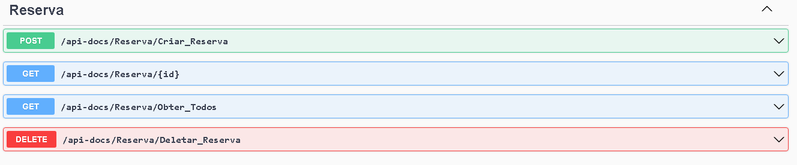

# API Rest Concluída ✅
## INFORMÇÕES DA API REST 📝
- Construido uma API REST utilizando .Net Core;
- A API tem uma rota com documentação swagger (http://.../api-docs).
- A API possui 4 operações:
  1) Registrar reserva: Recebe os dados do hospede ou dos hospedes + dados da suite + dias reservados;
  2) Buscar reserva: Busca pelo Id da reserva;
  3) Buscar todas as reservas: Busca todas reservas registradas;
  4) Deletar reserva: Deleta pelo Id da reserva;
- A API não tem mecanismos de autenticação/autorização; e
- A aplicação implementa os mecanismos de persistência "em memória".

## Modelo Conceitual


## Métodos

**swagger**


**EndPoints**
| Verbo  | Endpoint                          | Parâmetro | Body          |
|--------|-----------------------------------|-----------|---------------|
| POST   | /Reserva/api-docs/                | N/A       | Schema Reserva|
| GET    | /Reserva/api-docs/{id}            | id        | N/A           |
| GET    | /Reserva/api-docs/ObterTodos      | N/A       | N/A           |
| DELETE | /Reserva/api-docs/{id}            | id        | N/A           |

Esse é o schema (model) de Reserva, utilizado para passar os dados

```json
{
  "idReserva": 0,
  "hospedes": [
    {
      "idCliente": 0,
      "nome": "string",
      "cpf": 0,
      "telefone": 0
    }
  ],
  "suite": {
    "idSuite": 0,
    "tipoSuite": "Suite_Comum",
    "capacidadeSuite": 0,
    "valorDiaria": 0
  },
  "diasReservados": 0
}
```
